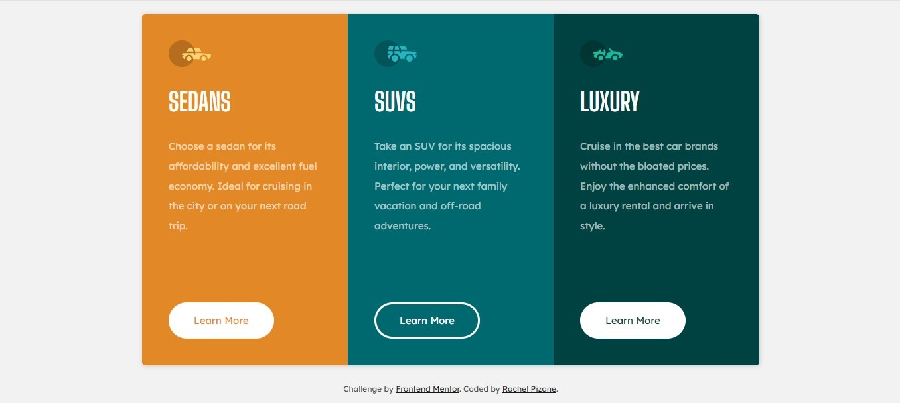

# Three Column Preview Card | Frontend Mentor 

This is a solution to the [Three Column Preview Card challenge on Frontend Mentor](https://www.frontendmentor.io/challenges/3column-preview-card-component-pH92eAR2-).

## Overview 🌎

### Screenshot

### Links

- Live Site URL: [GitHub Page - Three Column Preview Card](https://rachelpizane.github.io/FM03-3-Column-Preview-Card/)

## My process 🗺️

### Built with 

- Semantic HTML5 markup;
- CSS custom properties;
- CSS Grid;
- Flexbox.

### What I learned
- I had a hard time positioning the elements so that everything fit on the page, without having to scroll.

- Throughout the project I tested the page both via desktop and mobile, so that both were positioned correctly.

- Sometimes I feel like I add a lot of `justify-*` or `align-*` without need. It still gets confusing when I use `display: grid` or `display: flex`.

- I also included landmarks to improve accessibility and I avoided using the &lt;div&gt; tag excessively, according to the feedback I received on previous projects.

- As I didn't study Media Query and I only used them a few times, I don't know if I used them correctly.

- What I'm enjoying doing is designing the structure of the HTML, making markings over the layout. 

- In the end I processed a report in Lighthouse and had a good result via Desktop, but I need to improve via mobile. I made some adjustments, such as defining the width and height of the images and placing the Google fonts in the HTML, and I managed to increase my grade, however I still have a lot to learn with this tool.
